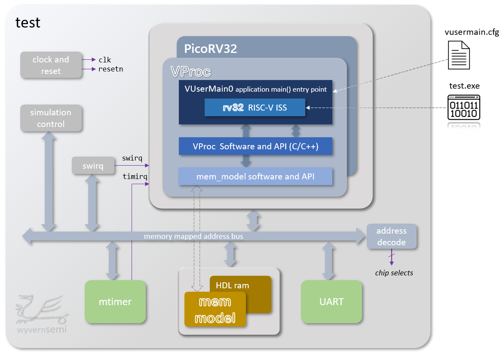
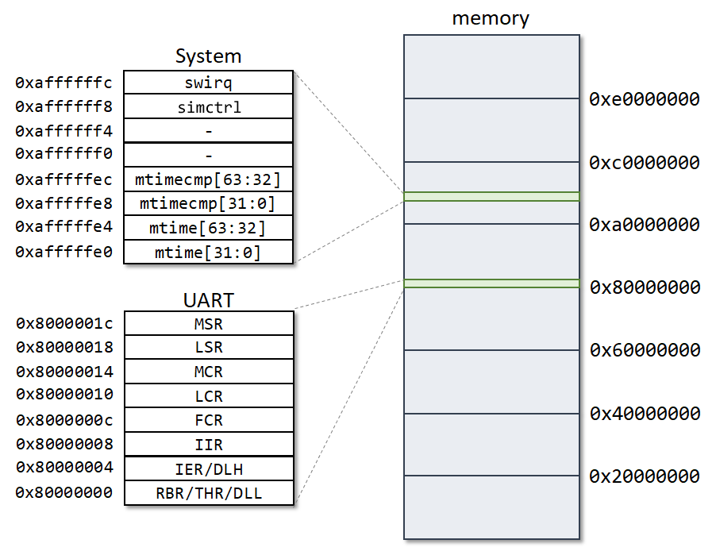

# Test Bench for Comparing VProc with rv32 ISS and PicoRV32 HDL

*** **THIS TEST BENCH IS FOR QUESTA OR MODEL SIM SIMULATORS ONLY** ***

## Dependencies

  This test is dependent on the following repositories to be located in the same directory as this repository, as defined by the
  `$(GITROOT)` variable in `makefile`:
  
* vproc    : https://github.com/wyvernSemi/vproc
* mem_model: https://github.com/wyvernSemi/mem_model
* picorv32 : https://github.com/YosysHQ/picorv32
  
The make file will attempt to clone any unfound repository into `$(GITROOT)`. Modify this variable if required.

## Test Bench Architecture

The diagram below shows a summary of the test bench architecture. The main processor can be selected between a *VProc* virtual processor running the *rv32* ISS or a PcioRV32 RTL implementation in Verilog, selected on a test bench parameter (see [next section](#user-defined-generics)). The selected processor has a generic memory mapped address bus on which is attached a timer, a UART and some memory. The memory can be selected with a generic to be either a behavioural HDL memory (64 KBytes) or the *mem_model* co-simulation VIP. Locally, logic implements a software interrupt function, which is memory mapped on the processor's address bus, and some simulation control where a "halt" function is mapped into the address bus to allows the running RISC-V program to stop the simulation. Chip selects for all these memory mapped functions are also implemented in the top level test bench, along with functionality to generate a clock at 100MHz and an active low reset.

<p align="center"></p>

## User Defined Generics

The `$(USRSIMFLAGS)` can be overridden on the command line, when running `make`, to change the simulation run, using the shell command:
```
  make USRSIMFLAGS="<flags>"
```

Use `USRSIMFLAGS="-gUSE_MEM_MODEL=[0|1]"` to select between HDL mem or *mem_model*, and `USRSIMFLAGS="-gRV32=[0|1]"` to select between *PicoRV32* or *VProc* with *rv32*. If *VProc* with *rv32* is selected, then it can use either HDL memory or *mem_model*. If the *PicoRV32* is selected then the HDL memory must be selected (default).


## Running the simulation

The simplest means to build and run a simulation is to execute the following command in a console from this directory:

```
  make run
```
This will build all the required files and run a simulation using the *VProc*/*rv32* processor and the HDL memory, executing a `test[.exe]` RISC-V program compiled from `test/test.s`. Other options are available and can be displayed with a `make help` command, giving:

```
  make help          Display this message
  make               Build C/C++ and HDL code without running simulation
  make sim           Build and run command line interactive (sim not started)
  make run           Build and run batch simulation
  make rungui/gui    Build and run GUI simulation
  make clean         clean previous build artefacts
```

### vusermain.cfg

Control and configuration of the *rv32* ISS can be done with the `vusermain.cfg` file. This acts like a virtual command line option input, and the default file has the following entry:

```
  vusermain0 -HT -b -A 0x00000040 -t test.exe
```

There are many more options to configure the ISS, and adding a `-h` to the `vusermain.cfg` file will, instead of running the program, give the following output:

```
Usage: vusermain0 -t <test executable> [-hHebdrg][-n <num instructions>]
      [-S <start addr>][-A <brk addr>][-D <debug o/p filename>][-p <port num>]
   -t specify test executable (default test.exe)
   -n specify number of instructions to run (default 0, i.e. run until unimp)
   -d Enable disassemble mode (default off)
   -r Enable run-time disassemble mode (default off. Overridden by -d)
   -C Use cycle count for internal mtime timer (default real-time)
   -a display ABI register names when disassembling (default x names)
   -T Use external memory mapped timer model (default internal)
   -H Halt on unimplemented instructions (default trap)
   -e Halt on ecall instruction (default trap)
   -E Halt on ebreak instruction (default trap)
   -b Halt at a specific address (default off)
   -A Specify halt address if -b active (default 0x00000040)
   -D Specify file for debug output (default stdout)
   -g Enable remote gdb mode (default disabled)
   -p Specify remote GDB port number (default 49152)
   -S Specify start address (default 0)
   -h display this help message
```

These option allow for such things as displaying runtime diassembled output, conditions for halting the program execution and for connecting a `gdb` debugger.

## The Test Bench Memory Map

Memory for the program and data starts from address `0x00000000`, with the HDL memory model top address being `0x00010000`. The diagram below shows how the peripherals are mapped into the address space.

<p align="center"></p>

## The Supplied Test Program

The source code in `src/test.s` is a simple RISC-V assembly language program to exercicse the RTL and co-simulation. Its purpose is to measure simulation executime between the *PicoRV32* RTL implementation against the running a co-simulation setup of *VProc* and the *rv32* ISS. After initialisation, the program has a main loop to execute a number of time, as defined by `MEMLOOPCOUNT`, doing a store word write to memory at an incrementing address, and then reading it back and verifying. After the load word read it branches to some more code which has its own loop to decrement a count in a loop, as defined by `COMPLOOPCOUNT`, before jumping back to the main loop. The purpose here is to have a main loop that is is load/store intensive, and a branch to a sub-loop which is compute intensive. By changing the ratio between `MEMLOOPCOUNT` and `COMPLOOPCOUNT` the program becomes more or less memory I/O oriented. This allows the measurement of execution time to indicate an indication of speed up using the co-simulation model versus a pure RTL implemenation of a processor.

### Initial Results

Tests were run on a Questa Altera Starter FPGA Edition-64 2025.2 simulator running on a Windows PC with an i5-8400 @2.8GHz. The ratios rather than the absolute times are the important measurement here, and execution speeds will vary between simulators and with other factors. The main point is to measure any speed advantages to using a co-simulation model over RTL.

When using the co-simulation model, the *rv32* ISS has internal memory (up to 1MBytes) from which the program can be run, or it can fetch instructions from the simulated memory over the address bus in the HDL&mdash;something the RTL model has to do. There are speed up advantages to using internal memory and over an HDL model, and both these scenarios were measured. By default, *rv32* does not use its internal memory. To enable this, the `USRFLAGS` variable in `makefile` can be set, on the command line or by updating `makefile`, with, for example, `-DUSE_INTERNAL_MEMORY -DINT_MEM_TOP=0x1000`. If updating these settings, a `make clean` before running the simulation is advised.

The table below shows the results obtained, as reported by the simulator for execution time of the simulation:

| MEMLOOPCOUNT | COMPLOOPCOUNT | PicoRV32 time | rv32 external | rv32 internal |
|--------------|---------------|---------------|---------------|---------------|
| 10000        | 10            | 1m47          | 2m15          | 0m33          |
| 1000         | 100           | 1m20          | 1m32          | 0m14          |
| 100          | 1000          | 1m17          | 1m28          | 0m09          |

These results seem to indicate that, for the RTL simulations, speed up as the program becomes more compute intensive only has a steady improvement, probably due to less signal changes when a bus access occurs. With co-simulated *rv32* and external memory, the results are <ins>slightly worse</ins>, probably due to VPI calling overheads. When using internal memory to run code, however, there is clear speed advantage of between 3 and 12 times, depending on the mix of I/O to compute. Also, for the *rv32* and internal memory, the number of instructions per second were measured and this was between 23 and 126 KIPS for the scenarios above.

For many applications, the main advantage of co-simulation is to run the developing embedded application software along with the devloping RTL logic. Here, the testing emphasises interaction between software and logic registers rather fetching instructions from the FPGA memory sub-system and reading and writing program data. The test bench can thus be set up to use internal memory for program/data accesses and gain the speed (and other) advantages of co-simulation. The *rv32* ISS can be configured to have an instruction timing model to match the target processor and can have appropriate delays for accesses to memory, advancing the simulation for the required number of cycles, even if instruction fetches and program data reads and writes do not appear on the address bus in the HDL simulation.

These measurements are indicitive but not universal and are likely to vary as more application RTL is added to a simulation and the contribution to simulation execution time of the processing element becomes a smaller fraction of the overall time.

## Files in this Directory

* **test.v**: top level test bench, incorporating the HDL memory module (`ram`)
* **test.vc**: List of HDL files to compile for the simulator
* **mtimer.v**: timer module to implemenat a RISC-V Zicsr `mtime` and `mtimecmp` registers.
* **uart.v**: An HDL model of a uart TX function, mapped into the memory space.
* **makefile**: a make file to compile and run all the necessary files for the simulation
* **vusermain.cfg**: *rv32* ISS configuration file
* **wave.do**: a default set of signals to display in the simulator GUI waveform viewer
* **test/test.s:** The default RISC-V test program assembly code
* **src/VUserMain0.cpp**: The main *VProc* node 0 program to run. This includes the fuctionality to configure and run the *rv32* ISS and interface it to the address bus in the simulation via the *VProc* API.
* **src/VUserMain0.h**: header for the above.
* **src/mem_vproc_api.cpp**: A set of wrapper functions around the *VProc* API to add simulation time for memory accesses
* **src/mem_vproc_api.h**: header for the above
* **src/getopt.c**: an implementaion of `getopt` for use on Windows
* **python/bin2hex.py**: A python script to convert a binary file from the RISC-V gcc compilation into a test hex output suitibale for use with Verilog's `$readmemh` system task.
* **README.md**: this file
* **images/\***: Images for use by this file